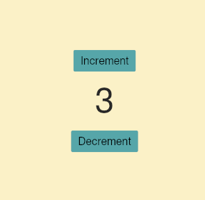
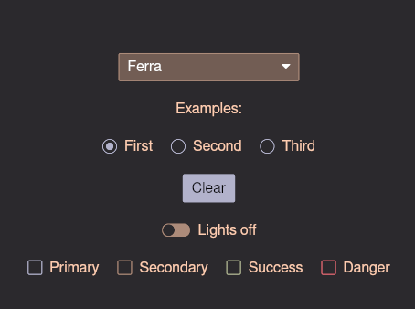

# iced-hs

Haskell wrapper for [iced](https://github.com/iced-rs/iced) gui library.
Very experimental, check [Roadmap](#roadmap) to see progress. There is some
[documentation](./docs) available.


## Platform support

Desktops - tested on Linux, and macOS should work too.
Build for Windows currently doesn't work, see related
[issue](https://github.com/ibaryshnikov/iced-hs/issues/19)
for more details.


## Example

Check [examples](examples) for more

```haskell
import Iced
import Iced.Attribute
import Iced.Attribute.Alignment
import Iced.Theme
import Iced.Widget

data Message = Inc | Dec

update :: Message -> Int -> Int
update Inc = succ
update Dec = pred

view :: Int -> Element
view value =
  container [centerX Fill, centerY Fill] $
    column [alignX Center, spacing 10] [
      button [onPress Inc] "Increment",
      text [size 50] $ show value,
      button [onPress Dec] "Decrement"
    ]

main :: IO ()
main = Iced.run [theme GruvboxLight] "Counter" 0 update view
```




## Themes example



Beautiful `Ferra` theme was built by [Halloy](https://github.com/squidowl/halloy) team.
Check the complete [example](examples/themes).


## Required build tools

Rust toolchain is 1.84 or above. Haskell build uses cabal and supported versions
are specified in `iced-hs.cabal` file. It's also possible to build with GHC alone.
Use provided bash scripts as an example.


## Usage

Run the examples with cabal:

```bash
cabal run counter
```

Or use bash scripts:

```bash
# build `libiced_hs.a`
./build_rust.sh
# then pass it to ghc
ghc -ipath/to/this/repo path/to/libiced_hs.a main.hs
```


## Internals

- [wgpu](https://github.com/gfx-rs/wgpu) - graphics
- [winit](https://github.com/rust-windowing/winit) - windowing
- [tokio](https://github.com/tokio-rs/tokio) - runtime
- [cosmic-text](https://github.com/pop-os/cosmic-text) - multi-line text handling


## Credits

Below is a list of inspiring projects
- [Elm](https://elm-lang.org/)
- [elm-ui](https://github.com/mdgriffith/elm-ui)
- [elm-canvas](https://github.com/joakin/elm-canvas)
- [webgl](https://github.com/elm-explorations/webgl)
- [miso](https://github.com/dmjio/miso)
- [monomer](https://github.com/fjvallarino/monomer)


## Status

This is a research project. The api may change often.
Not recommended for use in production. It still may be a good
option if you need a simple way to build some ui.


## Roadmap

 - [ ] Widgets
   - [x] button
   - [x] checkbox
   - [x] column
   - [x] comboBox
   - [x] container
   - [x] image
   - [ ] keyedColumn
   - [x] markdown
   - [x] mouseArea
   - [ ] paneGrid
   - [x] progressBar
   - [x] pickList
   - [ ] qrCode
   - [x] radio
   - [x] responsive
   - [ ] horizontalRule, verticalRule
   - [x] row
   - [x] scrollable
   - [x] slider, verticalSlider
   - [x] horizontalSpace, verticalSpace
   - [ ] svg
   - [x] text
   - [x] textEditor
   - [x] textInput
   - [x] toggler
   - [x] tooltip
 - [ ] Helper functions
   - [ ] lazy
   - [ ] themer
   - [ ] focusNext, focusPrevious
 - [x] Themes
 - [ ] Canvas api
   - [x] canvas widget
   - [x] fill path
   - [x] fillText
   - [x] pushTransform
   - [x] popTransform
   - [x] rotate
   - [x] scale
   - [x] stroke path
   - [x] path methods - circle, lineTo, moveTo, rectangle
   - [ ] more path methods
 - [ ] Shader
   - [ ] shader widget
   - [ ] attributes
 - [ ] Multi window
 - [ ] Custom widgets
 - [ ] Subscriptions
   - [x] subscription attribute for Application
   - [x] Time.every subscription
   - [ ] Keyboard
     - [x] onKeyPress
     - [x] onKeyRelease
     - [ ] PhysicalKey
       - [x] KeyCode
       - [ ] NativeKeyCode
     - [ ] LogicalKey
       - [x] Named
       - [ ] Character
   - [ ] custom subscriptions
   - [ ] other events
 - [x] Task api
   - [x] `Task.perform` for Rust `Future`
   - [x] `Task.performBlocking` for blocking tasks
 - [ ] Add all attributes from iced for each widget
 - [ ] Styles for widgets
   - [x] button
   - [x] checkbox
   - [x] container
   - [x] pickList
   - [x] progressBar
   - [x] radio
   - [x] text
   - [x] textInput
   - [x] textEditor
   - [ ] ...
